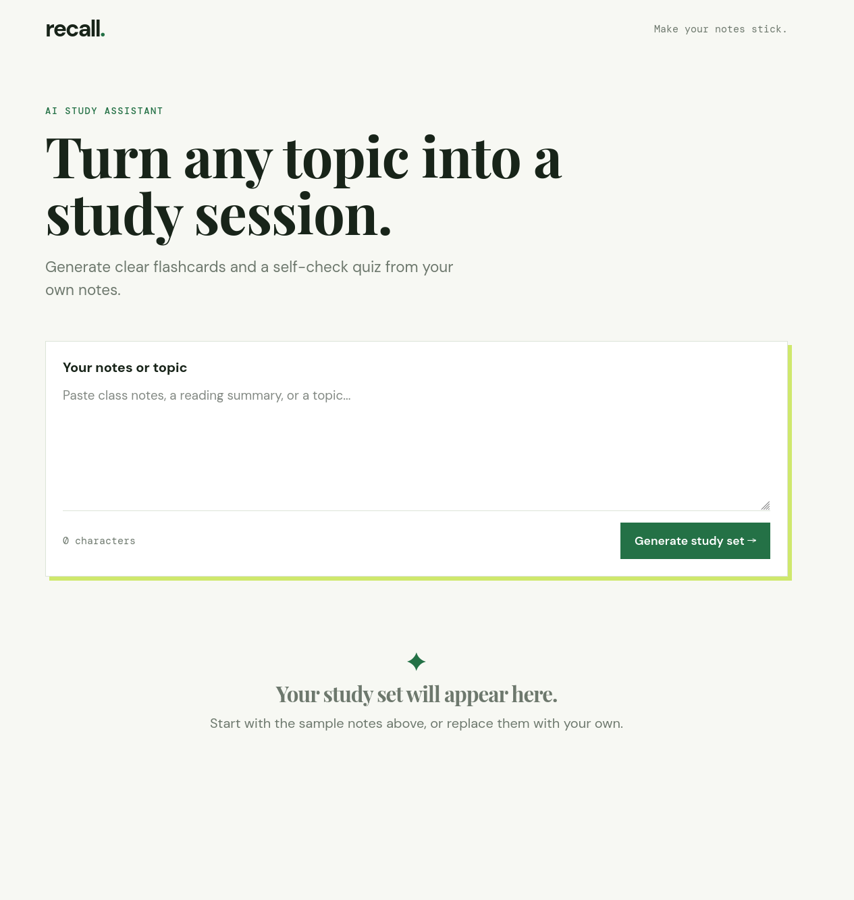
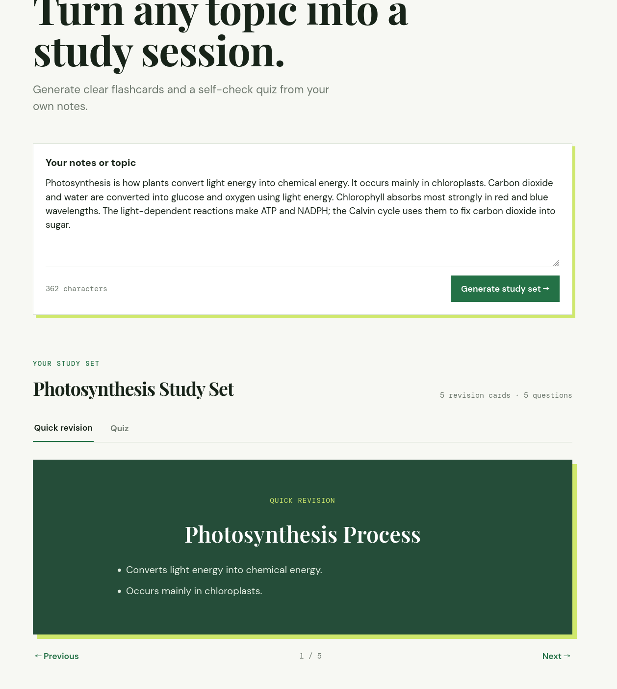
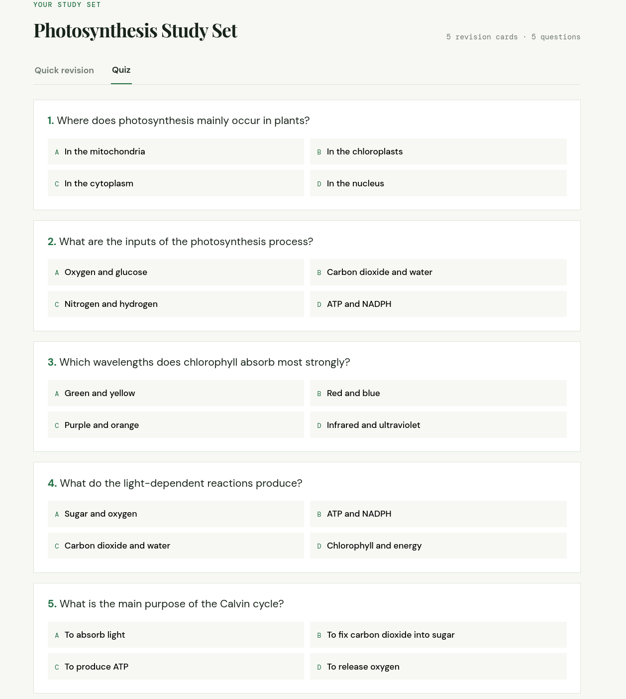

# Recall — AI Study Assistant

Recall turns pasted notes into concise revision flashcards and a self-checking multiple-choice quiz. It uses a React/Vite frontend and a small Express API so the OpenAI key never reaches the browser.

## Screenshots

## Working recording

[Watch the working project recording](https://drive.google.com/file/d/1FpSzLbx9zDPEStirYE1eJMwYnUhqIWTz/view?usp=sharing)

### Create a study set



### Review flashcards



### Test yourself



## Setup

### Prerequisites

- Node.js 18 or later
- An OpenAI API key

### Install and configure

```bash
npm install
cp .env.example .env
```

Add your key to `.env`:

```env
OPENAI_API_KEY=your_api_key_here
# Optional; defaults to gpt-4o-mini
OPENAI_MODEL=gpt-4o-mini
```

Start the frontend and API together:

```bash
npm run dev
```

Open the Vite address shown in the terminal, normally `http://localhost:5173`. The local API listens on `http://localhost:3001`.

To expose the Vite development server on your local network, use `npm start`. Create an optimized frontend build with `npm run build`; serving that build in production requires a static host plus a deployed API endpoint.

## Usage

1. Paste class notes, a reading summary, or a topic into the notes field (at least 20 characters).
2. Select **Generate study set**.
3. Review the generated revision cards; select a card or use the arrows to move through them.
4. Open the **Quiz** tab, choose one answer per question, and review the feedback.
5. After completing a quiz, use the retry option to practise the questions answered incorrectly.

The API produces between 5 and 50 questions, targeting roughly one question for every 30 words of supplied notes. It also creates 3–8 flashcards.

## How it works

```text
Notes → React UI → POST /api/generate → Express API → OpenAI
                                              ↓
Flashcards and quiz ← client-side JSON validation ← structured response
```

The server requests a strict JSON schema from OpenAI, sends the raw JSON response to the browser, and keeps the API key in server-only environment variables. React parses and validates the response before rendering it. Requests also use an incrementing ID so an older, slower response cannot replace a newer study set.

## AI usage note

AI assistance was used to help plan the component structure, draft styling, and review implementation edge cases. The final project is intentionally compact and documented so its behavior and design choices can be explained and changed easily.

The application itself uses the OpenAI API to generate study content. Generated material should be treated as revision support, not an authoritative source.

## Limitations

- AI-generated questions or explanations can be incomplete or inaccurate; users should verify them against the original notes.
- Study sets and quiz progress are kept only in browser memory, so they are lost on refresh.
- The frontend currently calls `localhost:3001`; deployment requires hosting the API (or replacing it with a serverless endpoint) and configuring its environment variables.
- Large note sets can take longer to generate and are subject to OpenAI availability, rate limits, and API costs.
- The app accepts plain text notes only; it does not extract content from files, images, or links.

## Time spent

Approximately 6–8 hours, including product design, React and Express implementation, API integration, error handling, testing, and documentation.

## Project files

- `src/App.jsx` — application UI, study interactions, and response validation
- `src/styles.css` — responsive visual styling
- `server/index.js` — API endpoint, schema request, and timeout/error handling
- `CODE_WALKTHROUGH.md` — architecture and implementation notes for a deeper code tour
